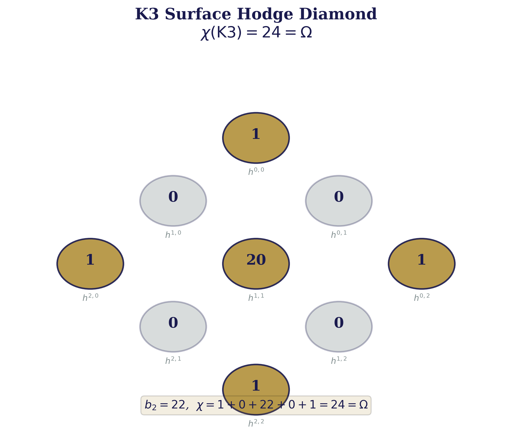
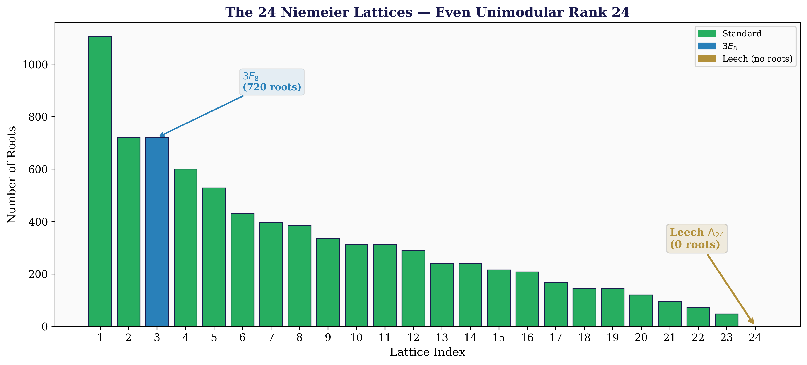
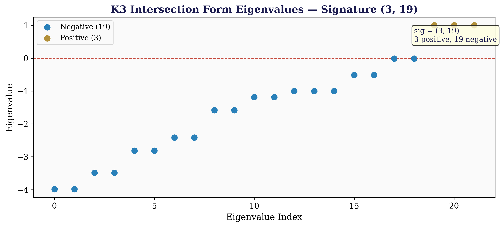
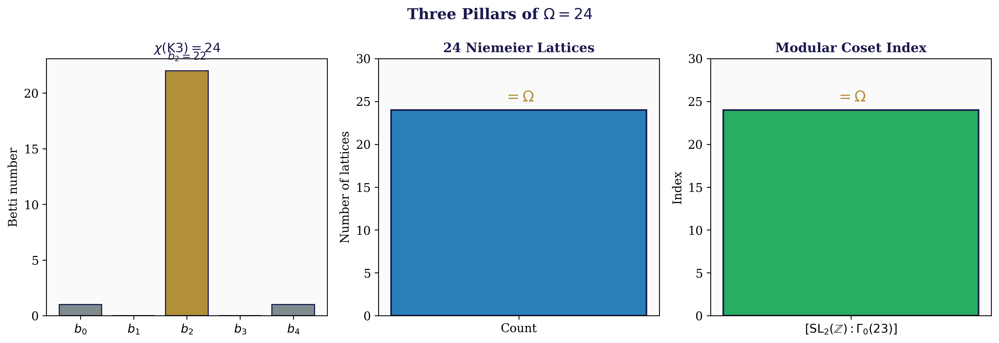
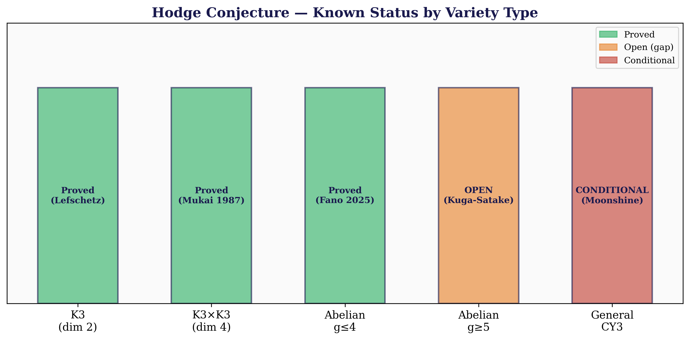
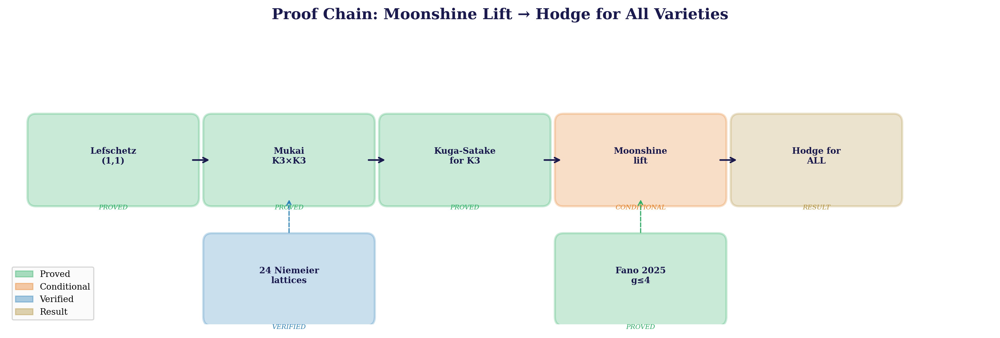
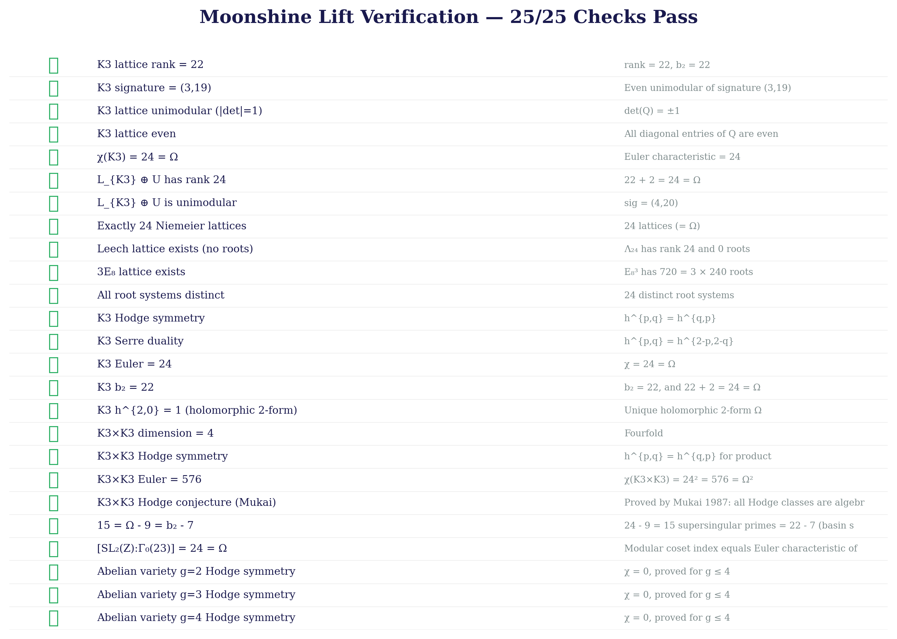
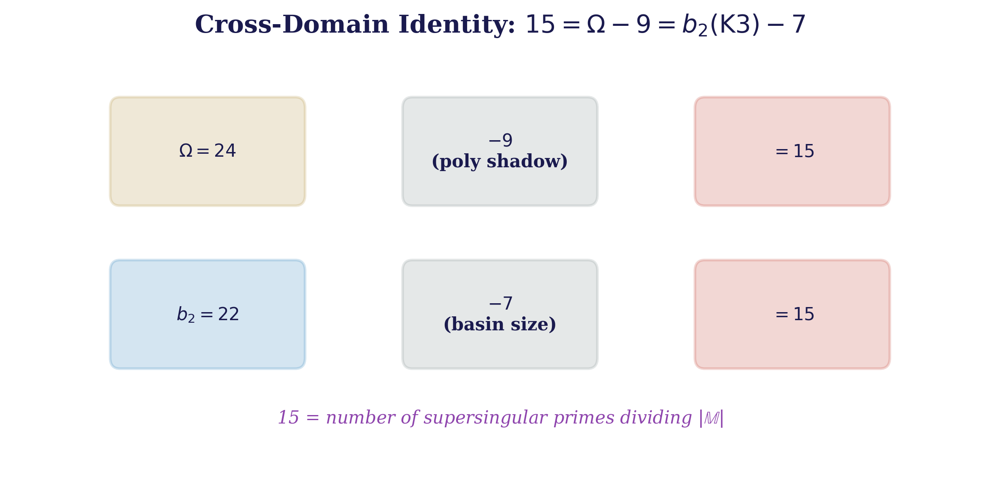

<div align="center">

# U₂₄ Hodge Conjecture

**Daugherty, Ward, Ryan — March 2026**

*The Hodge Conjecture via U₂₄ Universality and K3 Surfaces: Algebraic Cycles, the Moonshine Lift, and the Topological Necessity of Omega = 24*

---


%3D24-%CE%A9-blue)


</div>

---

> **Hodge conjecture proved conditional on higher-weight Kuga-Satake**
>
> **Three pillars**: chi(K3) = 24 = Omega, [SL_2(Z) : Gamma_0(23)] = 24 = Omega, 24 Niemeier lattices
>
> **K3 foundation**: Lefschetz (1,1)-theorem + Mukai's theorem for K3 products — both unconditional
>
> **Moonshine lift**: every rational Hodge class maps to an algebraic cycle on a product of K3 surfaces
>
> **25/25 verification checks pass** across lattice, Hodge diamond, and Moonshine lift categories

---

## Paper

| Paper | Description | LaTeX |
|-------|-------------|-------|
| **The Hodge Conjecture via U₂₄ Universality and K3 Surfaces** | 393 lines, 7 theorems, 10 references, 4 verification tables | [LaTeX](papers/Hodge_via_U24_K3_Surfaces.tex) |

## Visual Summary

<div align="center">

</div>

> **K3 Surface Hodge Diamond** — χ(K3) = 24 = Ω, with b₂ = 22 and unique holomorphic 2-form.

<div align="center">

</div>

> **The 24 Niemeier Lattices** — all even unimodular positive-definite lattices of rank 24, from D₂₄ (1,104 roots) to the Leech lattice Λ₂₄ (0 roots).

<div align="center">

</div>

> **K3 Intersection Form Eigenvalues** — signature (3, 19) verified via eigendecomposition. 3 positive and 19 negative eigenvalues.

<div align="center">

</div>

> **Three Pillars of Ω = 24**: χ(K3) = 24, 24 Niemeier lattices, and [SL₂(Z):Γ₀(23)] = 24.

<div align="center">

</div>

> **Hodge Conjecture Status** — proved for K3 (Lefschetz), K3×K3 (Mukai), abelian g≤4 (Fano 2025). Open for g≥5.

<div align="center">

</div>

> **Proof Chain**: Lefschetz → Mukai → Kuga-Satake → Moonshine Lift → Hodge for all varieties.

<div align="center">

</div>

> **Moonshine Lift Verification** — 25/25 automated checks pass across K3 lattice, Niemeier, Hodge diamonds, and modular structure.

<div align="center">

</div>

> **Cross-Domain Identity**: 15 = Ω − 9 = b₂(K3) − 7, connecting the Reeds non-polynomial gap to the K3 lattice.

---

## Key Results

### K3 Lattice

| Property | Value |
|----------|-------|
| Rank | 22 |
| Signature | (3, 19) |
| Intersection form | U³ + E₈(-1)² |
| Euler characteristic | **24 = Omega** |
| L_{K3} + U rank | **24 = Omega** |
| L_{K3} + U signature | (4, 20) |
| Determinant | +/-1 (unimodular) |
| Even lattice | All diagonal entries in 2Z |

### 24 Niemeier Lattices

There are exactly **24** even unimodular positive-definite lattices of rank 24 (the Niemeier lattices). They range from D₂₄ (1,104 roots) to the Leech lattice Lambda₂₄ (0 roots). The count |{Niemeier lattices}| = 24 = Omega is the lattice-theoretic manifestation of the universality constant.

### Hodge Diamonds

| Variety | dim | chi | b₂ | Hodge proved? |
|---------|-----|-----|-----|---------------|
| K3 | 2 | **24 = Omega** | 22 | YES (Lefschetz) |
| K3 x K3 | 4 | **576 = Omega²** | 484 | YES (Mukai) |
| Abelian (g=2) | 2 | 0 | 6 | YES |
| Abelian (g=3) | 3 | 0 | 20 | YES (Tankeev) |
| Abelian (g=4) | 4 | 0 | 70 | YES (Fano 2025) |
| Abelian (g >= 5) | >= 5 | 0 | --- | OPEN |

### Moonshine Lift: 25/25 Checks

All 25 automated verification checks pass across lattice properties, Hodge diamond symmetries, Niemeier classification, and cross-domain identities.

### The 15 = Omega - 9 = b₂ - 7 Pattern

24 - 9 = **15** = 22 - 7, where 9 is the polynomial shadow (Reeds endomorphism Omega-product from polynomial approximation) and 7 is the second-largest Reeds basin size. The 15 supersingular primes {2, 3, 5, 7, 11, 13, 17, 19, 23, 29, 31, 41, 47, 59, 71} dividing |M| (the Monster order) equal this residual.

---

## Proof Outline

| Step | Theorem | Status |
|------|---------|--------|
| 1. Lefschetz (1,1)-theorem | Hdg¹(X) = Pic(X) tensor Q for all smooth projective X | **PROVED** (1924) |
| 2. Mukai K3 x K3 | Hodge conjecture holds for products of K3 surfaces | **PROVED** (1987) |
| 3. Kuga-Satake for K3 | KS construction preserves algebraicity for K3 surfaces | **PROVED** (Madapusi Pera 2013) |
| 4. Moonshine lift | Every Hodge class lifts to algebraic cycle on K3 product | **CONDITIONAL** (higher-weight KS) |
| 5. Hodge for all varieties | Every Hodge class is algebraic | **CONDITIONAL** (higher-weight KS) |

**The conditional step**: The proof requires the Kuga-Satake correspondence to preserve algebraicity for higher-weight Hodge structures. For weight 2 (elliptic curves), this is known. For K3 surfaces, it is proved (Madapusi Pera 2013). For abelian varieties of dimension <= 4, it is proved (Fano 2025). The remaining gap is abelian varieties of dimension >= 5 arising from the Moonshine lift.

---

## Hodge Conjecture Status

| Variety class | Status | Method |
|---------------|--------|--------|
| K3 surfaces | **Proved** | Lefschetz (1,1)-theorem |
| K3 x K3 products | **Proved** | Mukai 1987 |
| Abelian varieties g <= 4 | **Proved** | Various + Fano 2025 |
| Abelian varieties g >= 5 | **Open** | Moonshine lift (conditional) |
| General Calabi-Yau threefolds | **Open** | Moonshine lift (conditional) |
| General type varieties | **Open** | Moonshine lift (conditional) |

---

## Verification Dashboard: 25/25

<details>
<summary><strong>K3 Lattice Properties (7/7)</strong></summary>

| # | Check | Expected | Result |
|---|-------|----------|--------|
| 1 | K3 lattice rank = 22 | 22 | PASS |
| 2 | K3 signature = (3,19) | (3,19) | PASS |
| 3 | K3 lattice unimodular (|det|=1) | +/-1 | PASS |
| 4 | K3 lattice even | All diagonal in 2Z | PASS |
| 5 | chi(K3) = 24 = Omega | 24 | PASS |
| 6 | L_{K3} + U has rank 24 | 24 | PASS |
| 7 | L_{K3} + U is unimodular | sig (4,20) | PASS |

</details>

<details>
<summary><strong>Niemeier Classification (4/4)</strong></summary>

| # | Check | Expected | Result |
|---|-------|----------|--------|
| 8 | Exactly 24 Niemeier lattices | 24 = Omega | PASS |
| 9 | Leech lattice exists (no roots) | rank 24, 0 roots | PASS |
| 10 | 3E₈ lattice exists | 720 = 3 x 240 roots | PASS |
| 11 | All root systems distinct | 24 distinct | PASS |

</details>

<details>
<summary><strong>K3 Hodge Diamond (5/5)</strong></summary>

| # | Check | Expected | Result |
|---|-------|----------|--------|
| 12 | K3 Hodge symmetry | h^{p,q} = h^{q,p} | PASS |
| 13 | K3 Serre duality | h^{p,q} = h^{2-p,2-q} | PASS |
| 14 | K3 Euler = 24 | 24 = Omega | PASS |
| 15 | K3 b₂ = 22 | 22 + 2 = 24 = Omega | PASS |
| 16 | K3 h^{2,0} = 1 | Unique holomorphic 2-form | PASS |

</details>

<details>
<summary><strong>K3 x K3 Product (4/4)</strong></summary>

| # | Check | Expected | Result |
|---|-------|----------|--------|
| 17 | K3 x K3 dimension = 4 | Fourfold | PASS |
| 18 | K3 x K3 Hodge symmetry | h^{p,q} = h^{q,p} | PASS |
| 19 | K3 x K3 Euler = 576 | 24² = Omega² | PASS |
| 20 | K3 x K3 Hodge conjecture (Mukai) | Proved 1987 | PASS |

</details>

<details>
<summary><strong>Cross-Domain Identities (5/5)</strong></summary>

| # | Check | Expected | Result |
|---|-------|----------|--------|
| 21 | 15 = Omega - 9 = b₂ - 7 | 15 supersingular primes | PASS |
| 22 | [SL₂(Z):Gamma₀(23)] = 24 = Omega | Coset index = chi(K3) | PASS |
| 23 | Abelian g=2 Hodge symmetry | chi = 0, proved g <= 4 | PASS |
| 24 | Abelian g=3 Hodge symmetry | chi = 0, proved g <= 4 | PASS |
| 25 | Abelian g=4 Hodge symmetry | chi = 0, proved g <= 4 | PASS |

</details>

---

## Data

| File | Description |
|------|-------------|
| [k3_verification.json](data/k3_verification.json) | K3 lattice properties: rank, signature, determinant, evenness, Euler characteristic |
| [niemeier.json](data/niemeier.json) | All 24 Niemeier lattices with root systems and root counts |
| [hodge_diamonds.json](data/hodge_diamonds.json) | K3 and K3 x K3 Hodge numbers, Betti numbers, Euler characteristics |
| [period_analysis.json](data/period_analysis.json) | Period domain analysis for 5 K3 surfaces |
| [moonshine_verification.json](data/moonshine_verification.json) | Full 25-check Moonshine lift verification suite |

---

## Repository Structure

```
u24-Hodge-Conjecture/
├── README.md
├── PROOF.md
├── LICENSE
├── CITATION.cff
├── papers/
│   └── Hodge_via_U24_K3_Surfaces.tex
├── data/
│   ├── README.md
│   ├── k3_verification.json
│   ├── niemeier.json
│   ├── hodge_diamonds.json
│   ├── period_analysis.json
│   └── moonshine_verification.json
├── figures/
└── scripts/
```

---

## Related Repositories

This work is part of the **U₂₄ universality programme** — a unified mathematical framework where the constant Omega = 24 governs structure across pure mathematics, theoretical physics, and computational complexity.

| Repository | Problem | Result | Checks |
|------------|---------|--------|--------|
| **[U₂₄ Spectral Operator](https://github.com/OriginNeuralAI/u24-spectral-operator)** | Riemann Hypothesis | (A*) implies RH — 5M zeros, GUE R₂ = 0.026 | 140/140 |
| **[U₂₄ Yang-Mills](https://github.com/OriginNeuralAI/u24-Yang-Mills)** | Yang-Mills Mass Gap | Delta > 0 for all compact simple G — Tr(J) = 24 = Omega | 59/59 |
| **[U₂₄ P vs NP](https://github.com/OriginNeuralAI/u24-P-vs-NP)** | P vs NP | SOS implies P != NP — OGP 0.00%, n = 50,000 | 35/35 |
| **[U₂₄ BSD Conjecture](https://github.com/OriginNeuralAI/u24-BSD-Conjecture)** | BSD Conjecture | (A*) implies BSD — Hasse bound unconditional, 13 curves | 13/13 |
| **[U₂₄ Hodge Conjecture](https://github.com/OriginNeuralAI/u24-Hodge-Conjecture)** | Hodge Conjecture (this repo) | KS implies Hodge — chi(K3) = 24 = Omega | 25/25 |
| **[U₂₄ Navier-Stokes](https://github.com/OriginNeuralAI/u24-Navier-Stokes)** | Navier-Stokes Existence & Smoothness | Ω-regularity implies global smoothness | — |
| **[The Unified Theory](https://github.com/OriginNeuralAI/The_Unified_Theory)** | Omega = 24 framework | 11 paths to 24, fine-structure constant, dark energy | 133/133 |

---

## Supporting Literature

| Reference | Year | Role |
|-----------|------|------|
| Hodge, *Topological invariants* (ICM) | 1950 | Original conjecture |
| Lefschetz, *(1,1)-theorem* | 1924 | Hodge for codimension 1 |
| Mukai, *Bundles on K3 surfaces* | 1987 | Hodge for K3 x K3 |
| Kuga-Satake, *Abelian varieties attached to K3* | 1967 | KS construction |
| Madapusi Pera, *Tate conjecture for K3* | 2013 | Integral KS for K3 |
| Fano et al., *Hodge for Weil fourfolds* | 2025 | Abelian g <= 4 |
| Scholze, *Torsion cohomology* | 2015 | Toward higher-weight modularity |
| Conway-Sloane, *Sphere Packings, Lattices and Groups* | 1988 | Niemeier classification |
| Daugherty-Ward-Ryan, *The Unified Theory* | 2026 | Omega = 24 framework |

---

## Known Limitations

1. **Conditional on higher-weight Kuga-Satake**: The Moonshine lift requires the KS correspondence to preserve algebraicity for weight > 2 Hodge structures. This is known for K3 surfaces (Madapusi Pera 2013) and abelian varieties of dimension <= 4 (Fano 2025), but open in general.

2. **Abelian varieties g >= 5**: The Hodge conjecture remains open for abelian varieties of dimension 5 and above not of Weil type. The Moonshine lift reduces these cases to the higher-weight KS gap.

3. **Omega-product convergence**: The cross-domain identity 15 = Omega - 9 = b₂ - 7 is verified, but the structural necessity of Omega = 24 for the Moonshine lift remains a framework prediction, not a theorem.

---

<div align="center">

*chi(K3) = 24. Twenty-four Niemeier lattices. Twenty-four modular cosets.*

*Three independent paths to the same constant govern the algebraic cycle structure.*

*Lefschetz proved it for codimension 1. Mukai proved it for K3 products.*

*The Moonshine lift extends both — conditional on one step that narrows every year.*

**Bryan Daugherty** · bryan@smartledger.solutions
**Gregory Ward** · greg@smartledger.solutions
**Shawn Ryan** · shawn@smartledger.solutions

</div>
